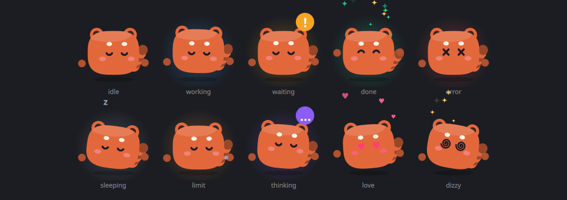

# perch

A small red panda named **Maple** sits on the edge of your screen and watches
your [Claude Code](https://code.claude.com) sessions. Answer permission prompts
without going back to the terminal, see what each session is doing, and get a
little cheer when one finishes.

For Linux Wayland desktops, built on [Quickshell](https://quickshell.org).




## What it does

- **Approve or deny from anywhere.** When Claude Code asks for permission, the
  island opens with the exact command. Allow, Deny, or Always (adds the rule
  Claude Code suggests). The terminal prompt stays live too; whichever you
  answer first wins.
- **Watch every session.** A pill shows the latest action (`Edit Invoice.swift`,
  `Bash npm test`) and a dot per session. Hover for the full list; click a
  session to jump to its terminal (Hyprland out of the box, anything else with
  `focusCommand`).
- **Know when it's done.** Maple flips, sparkles and shows Claude's last reply.
- **Usage warnings.** With `--statusline`, Maple starts sweating at 80% of your
  5-hour or weekly limit and the island shows when it resets.
- **Ask Claude.** A quick question box that runs `claude -p`, so it uses your
  existing Claude plan; no API key.
- **Feed Maple files.** Drop files on the island, then ask about them or copy
  their paths.

Maple's moods: idle, thinking, working, waiting on you, done, sleeping, and
tired when you're near your limit. Her eyes follow your cursor. Rest the cursor
on her for hearts. Click her and she's annoyed. Click three times fast and
she's dizzy.

## Safety

- The hook never blocks Claude Code. perch not running → the hook exits in
  milliseconds and prints nothing.
- A hook that prints nothing never decides a permission. Every failure
  (crash, timeout, perch restarted) falls back to the normal terminal prompt;
  nothing gets approved by accident.
- Y/N keyboard shortcuts only work after you click the island, so typing in
  your terminal can never approve something by mistake.
- No network, no telemetry, no keys. The socket lives in `$XDG_RUNTIME_DIR`,
  which only your user can access.

## Install

Needs: [Quickshell](https://quickshell.org) 0.2+, Python 3, Claude Code.
Optional: Hyprland (jump to terminal, cursor-following eyes), `wl-clipboard`
(copy buttons).

```sh
git clone https://github.com/teslaoruz/perch ~/.local/share/perch
cd ~/.local/share/perch
./install.sh --statusline --service
```

`install.sh` links the config to `~/.config/quickshell/perch` and adds the
hooks to `~/.claude/settings.json`. It shows you the diff and asks first, keeps
a dated backup, and only touches its own entries. Restart running Claude Code
sessions so they pick up the hooks.

- `--statusline` wraps your existing statusline to read the usage limits; its
  output is passed through unchanged.
- `--service` installs a systemd user service. Without it, run `qs -c perch`
  or add that to your compositor's autostart.
- `./install.sh --uninstall` removes all of it.

## Configure

Create `~/.config/perch/config.json`; changes apply live. Every key is
optional, see [`config.example.json`](config.example.json).

| Key | Default | |
|---|---|---|
| `position` | `top-right` | `top-left` `top` `top-right` `left` `right` `bottom-left` `bottom` `bottom-right` |
| `marginX`, `marginY` | `12`, `8` | distance from the screen edge |
| `screen` | first | output name, e.g. `DP-1` |
| `scale` | `1` | |
| `color` | `#e2683c` | Maple's fur |
| `hideWhenIdle` | `true` | only a small nub while nothing runs |
| `autoOpenOnPermission` | `true` | |
| `celebrate` | `true` | open briefly when a session finishes |
| `collapseDelay` | `1200` | ms after the cursor leaves |
| `trackCursor` | `true` | eyes follow the cursor across the screen (Hyprland) |
| `limitWarn` | `80` | % that triggers the usage warning |
| `askModel` | | `--model` for the ask box |
| `focusCommand` | | argv to focus a session; `{window}` `{pid}` `{cwd}` are filled in |

## Keybinds

```sh
qs -c perch ipc call perch toggle   # open / close
qs -c perch ipc call perch ask      # open the ask box
qs -c perch ipc call perch allow    # answer the oldest permission request
qs -c perch ipc call perch deny
```

## How it works

```
claude ─ hook ─► hook/perch-hook ─ $XDG_RUNTIME_DIR/perch.sock ─► perch (Quickshell)
                       ▲                                              │
                       └──────────── allow / deny (PermissionRequest) ┘
```

`perch-hook` is one standard-library Python file. On a `PermissionRequest`, it
keeps the socket open until perch answers. If you answer in the terminal
instead, the session's next event tells perch to drop the request.

## Develop

```sh
qs -p .                 # run from the checkout
sh dev/tour.sh          # fake sessions through every view, screenshots in dev/
sh dev/test_hook.sh     # end-to-end hook checks
qs -p preview.qml       # all of Maple's moods side by side
```

## Credits

Inspired by [coucou](https://github.com/louis-CFM/coucou) by Louis Raillé,
a notch companion for Claude Code on macOS. perch is its own code and its own
character.

Not affiliated with Anthropic. Claude and Claude Code are trademarks of
Anthropic.

MIT licensed.
