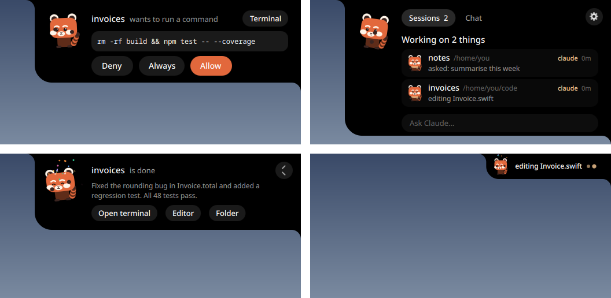

<div align="center">


# Emba

**A little red panda that keeps an eye on your coding agents.**

Approve what they want to run without going back to the terminal, see what each one is doing,
and get a small cheer when they finish. For Claude Code, Codex, Gemini CLI and opencode.

[](https://github.com/teslaoruz/emba/actions/workflows/ci.yml)
[](LICENSE)

[](https://github.com/teslaoruz/emba/releases)

**[Install](#install)** · **[Features](#what-it-does)** · **[Agents](#agents)** · **[Using it](#using-it)** · **[Plugins](#plugins)** · **[Troubleshooting](#troubleshooting)** · **[License](#license)**


</div>

## What it does

### Stay in charge of your agents

- **Answer permission requests from anywhere.** When an agent wants to run a command or edit a
  file, Emba pops up with exactly what it wants to do. Allow, deny, or always allow. The terminal
  prompt stays live too; whichever you answer first wins.
- **Answer their questions too.** When Claude asks you something, Emba shows the question and its
  options; click one, or type your own answer. Other agents' questions are shown plainly, with a
  button that takes you to their terminal.
- **See every session at a glance.** What each agent is doing right now, in plain words.
  Click a session to jump to its terminal.
- **Many agents at once.** Any number of sessions from Claude Code, Codex, Gemini CLI and opencode,
  side by side, each with its project, folder, running time and its agent's colour. With nothing
  busy, a tiny row of coloured dots stays in the corner.
- **Keep an eye on usage.** How much of each usage window is left, for every agent that reports it
  (Claude through its status line, Codex from its own logs). Emba warns you when one runs low.
- **Know when it's done.** Emba flips, sparkles and shows the last reply.
### Ask, show, talk

- **Ask a quick question.** A small ask box that uses the agent you already have, on your own
  account: no API keys. Pick who answers: Claude, Codex, opencode, Gemini, or a local Ollama model.
  Follow up in place, or continue the conversation in the agent's own terminal (the terminal you
  used last, or `$TERMINAL`).
  Or chat straight with Claude, OpenAI or Gemini on your own API key (Settings → Integrations);
  pick the model from the list your account offers.
- **Show it your screen.** Drag a rectangle anywhere and ask about what's in it.
- **Feed it files.** Drop a file on Emba to ask about it.
- **Talk to it** (optional). Shake the mouse or say "Hey Emba", ask out loud, hear the answer.
  Speech is recognised and spoken on your computer; nothing is sent anywhere.
### A companion, not a dashboard

- **It has a life of its own.** Left alone, Emba dances, stretches, hops, sneezes and chases its
  tail; while an agent works it types on a tiny laptop, and it cheers with confetti when work is done.
  Put on some music and it pops out and dances along (Linux, any MPRIS player).
- **Look after it.** Emba gets hungry, sleepy and a bit lonely. Rub the cursor over it to pet it,
  double-click to feed it bamboo, click the island to throw it a ball, hold it to tuck it in.
- **Your services at a glance.** Paste a key for Vercel, Stripe, Resend, Cal.com, Notion or n8n
  and the island shows a line from each: the latest deployment, today's payments, bounced emails,
  your next booking, the page you edited last, failed workflow runs. Keys stay in your system
  keyring (Keychain, Credential Manager, Secret Service), never in a file. GitHub needs no key: it
  uses the `gh` you're logged in with.
- **Little sounds**, if you want them: a chime when an agent needs you, a jingle when it's done.
- **Make it yours.** It follows your desktop's colours (Caelestia, pywal, or your own), sits in
  any corner, and can be extended with plugins.

<div align="center">

<br>

<br><br>

</div>

## Install

| | Needs |
|---|---|
| Linux | Python 3.9+. On Wayland with layer-shell, [Quickshell](https://quickshell.org); anywhere else the installer sets up Qt for you |
| macOS | Python 3.9+ (the installer sets up Qt) |
| Windows | Python 3.9+ (the installer sets up Qt) |

**Linux and macOS**

```sh
curl -fsSL https://raw.githubusercontent.com/teslaoruz/emba/main/install.sh | sh
```

**Windows** (PowerShell)

```powershell
irm https://raw.githubusercontent.com/teslaoruz/emba/main/install.ps1 | iex
```

**Arch Linux**: build the package from [`packaging/aur`](packaging/aur/PKGBUILD) with `makepkg -si`.

The installer asks before connecting any agent and shows you every change it makes to an agent's
settings; each file gets a backup first. It also asks whether you want voice (free local speech
models, about 250 MB); you can add or remove that later in Settings. Nothing needs admin rights. To remove everything later:
`./install.sh --uninstall` (or `install.ps1 --uninstall`).

On Wayland desktops with layer-shell (Hyprland, Sway, niri, KDE…) Emba runs on
[Quickshell](https://quickshell.org) and sits right on the edge of the screen. Everywhere else
(Windows, macOS, GNOME, X11) the same interface runs on Qt.

## Agents

| Agent | Watch sessions | Answer permissions | Answer questions | Usage | Ask box |
|---|:-:|:-:|:-:|:-:|:-:|
| Claude Code | ✓ | ✓ | ✓ | ✓ | ✓ |
| Codex | ✓ | ✓ | in its terminal | ✓ | ✓ |
| opencode (1.x and 2.x) | ✓ | ✓ (first 30 s, then the terminal) | in its terminal | | ✓ |
| Gemini CLI | ✓ | points you to the terminal | in its terminal | | ✓ |
| Ollama | | | | | ✓ |

Connect any or all of them in **Settings → Agents**, or with `emba connect`. **Add an agent** in
Settings shows how to install the ones you don't have yet. Any other agent with Claude Code style
hooks can report to Emba too: point its hooks at `hook/emba-hook --agent its-name`.

**Free options.** Emba itself is free and open source. For the ask box you can use Gemini CLI's
free tier, opencode's free models, or a model running on your own machine with Ollama.

## Using it

| | |
|---|---|
| Open or close | hover the island; click anywhere else or press <kbd>Esc</kbd> to close; `emba toggle` |
| Allow / deny | click, or press <kbd>Y</kbd> / <kbd>N</kbd> after clicking the island |
| Ask | click "Ask…", or `emba ask "your question"` |
| Ask about the screen | the frame icon in the ask box, or `emba look`: drag a rectangle, or click a window to take all of it (Hyprland) |
| Talk | shake the mouse, say "Hey Emba", or `emba listen` |
| Settings | the gear on the island, right-click it, or `emba settings` |
| Back | the arrow in the corner returns to the sessions from any other view |
| Look after Emba | rub the cursor over it to pet, double-click to feed, click to throw a ball, hold to tuck in |

Voice commands for Emba itself: *"eat"*, *"play"*, *"go to sleep"*, *"wake up"*,
*"look at my screen"*, *"settings"*. Saying *"allow"* while a request is open only highlights the
button: voice never approves anything on its own.

<details>
<summary><b>All settings</b></summary>

Everything is in the settings window. Behind it is a plain file,
`~/.config/emba/config.json` (Windows: `%APPDATA%\emba\config.json`), which also takes:

| Key | Default | |
|---|---|---|
| `position` | `top-right` | `top-left` `top` `top-right` `left` `right` `bottom-left` `bottom` `bottom-right` |
| `marginX`, `marginY` | `12`, `8` | distance from the screen edge |
| `scale` | `1` | |
| `color` | `#e2683c` | Emba's fur |
| `theme` | `auto` | `auto` `caelestia` `pywal` `custom` `default` |
| `askWith` | `auto` | `claude` `gemini` `opencode` `codex` `ollama` |
| `askModel` | | model for the ask box |
| `focusCommand` | | command to focus a session's terminal; `{window}` `{pid}` `{cwd}` are filled in |
| `limitWarn` | `80` | warn at this % of any agent's usage window |
| `danceToMusic` | `true` | pop out and dance while music plays |
| `sounds`, `soundVolume` | `true`, `0.5` | little sound effects, and how loud |
| `voice`, `voiceReply` | `false`, `true` | talk to Emba; have it read answers aloud |
| `voiceShake`, `voiceWake` | `true`, `false` | shake the mouse to talk; listen for "Hey Emba" |

`emba set KEY VALUE` changes one from the command line.
A custom theme is a `~/.config/emba/theme.json` with any of `base surface text dim primary ok warn
error`… as hex colours; point matugen or wallust at it.

</details>

<details>
<summary><b>Command line</b></summary>

```
emba                     start (in the background)
emba settings            open settings
emba ask "question"      ask, and show the answer
emba look                drag a rectangle on screen and ask about it
emba listen              talk to Emba
emba allow | deny        answer the oldest permission request
emba answer "option"     answer the waiting question
emba feed | play | nap   look after Emba
emba connect [AGENT]     connect claude, codex, gemini, opencode (shows each change first)
emba disconnect [AGENT]
emba autostart on|off
emba key set NAME        save an integration key from $EMBA_KEY into the system keyring
emba key delete NAME
emba models TOOL         the models a chat tool offers
emba email FILE...       a new email with these files attached
emba voice-install       set up voice (free, local, ~250 MB)
emba voice-remove        remove it again
emba doctor              check everything Emba needs
emba plugins [new NAME]  list plugins, or start your own
```

</details>

## Plugins

A plugin is a folder with a `plugin.json`. It can run a command when something happens (a session
finishes, an agent asks for permission…), add buttons, or show its own little panel. Four come
with Emba: **GitHub** (checks and the pull request for each session's repository, through the `gh`
CLI you're already logged in with), desktop notifications, "open in editor / folder", and a session
timer. Switch them on in Settings → Plugins.

```sh
emba plugins new my-plugin   # creates ~/.config/emba/plugins/my-plugin/plugin.json
```

See **[PLUGINS.md](PLUGINS.md)** for everything a plugin can do.

## Privacy and safety

- Emba never blocks your agents. If it isn't running, the hook exits in milliseconds and prints
  nothing.
- Every failure (a crash, a timeout, a restart) falls back to the agent's normal terminal prompt.
  Nothing is ever approved by accident.
- Keyboard shortcuts only work after you click the island, so typing in a terminal can't approve
  something by mistake.
- No telemetry, no accounts, no keys. Emba talks to your agents over a local socket only your user
  can open. Voice runs entirely on your computer.

## Troubleshooting

- **Run `emba doctor` first.** It checks everything Emba needs and says what to fix.
- **Nothing shows up for an agent.** Check it's switched on in Settings → Agents, then start a
  new session of that agent (running sessions keep their old settings).
- **Emba doesn't hear you.** Shaking the mouse should show "Listening". If it then says it heard
  nothing, the microphone isn't picking up your voice: check the input device and its level in your
  system's sound settings.
- **The island is in the wrong place.** Pick a corner in Settings → Where.
- **Still stuck?** [Open an issue](https://github.com/teslaoruz/emba/issues) with the output of
  `emba doctor`.

## How it works

```
your agent ─ hook ─► hook/emba-hook ── local socket ──► Emba
                          ▲                               │
                          └──── allow / deny ─────────────┘
```

The hook is one standard-library Python file that turns each agent's events into the same small
messages. The interface is QML, written once: on Linux it runs on Quickshell, elsewhere
`desktop/host.py` runs the very same files on Qt (PySide6).

## Contributing

Bug reports, ideas and pull requests are welcome; see [CONTRIBUTING.md](CONTRIBUTING.md).

```sh
git clone https://github.com/teslaoruz/emba && cd emba
qs -p .                      # run from the checkout (or: python desktop/host.py)
python tests/test_e2e.py     # end-to-end check against a running Emba
```

## Credits

Emba is written from scratch: its code, its character and its look are its own. The idea of a
companion living at the edge of the screen comes from notch apps such as
[coucou](https://github.com/louis-CFM/coucou). Sound effects by [Kenney](https://kenney.nl)
(public domain).

## Disclaimer

Emba is an independent open-source project. It is not affiliated with, endorsed by or sponsored by
Anthropic, OpenAI, Google, SST or any other company whose tools it works with. Claude, Claude Code,
Codex, Gemini, opencode and other names are trademarks of their respective owners and are used only
to say which tools Emba works with.

## License

Emba's code is free software under the [GNU General Public License v3.0](LICENSE): you may use,
study, share and change it, and anything you share that is built from it must stay under the same
license, with its source. The name "Emba" and the Emba character are covered separately in
[LICENSE-ASSETS.md](LICENSE-ASSETS.md): forks are welcome, under their own name and character.
